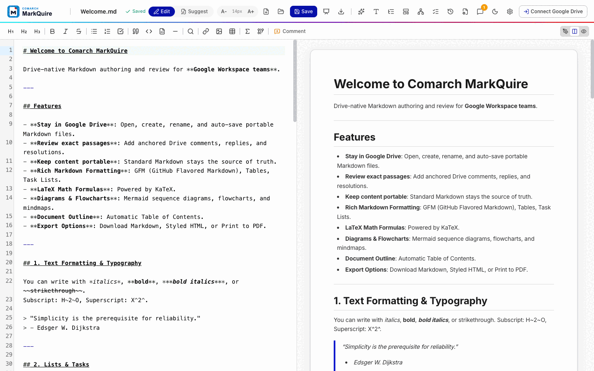
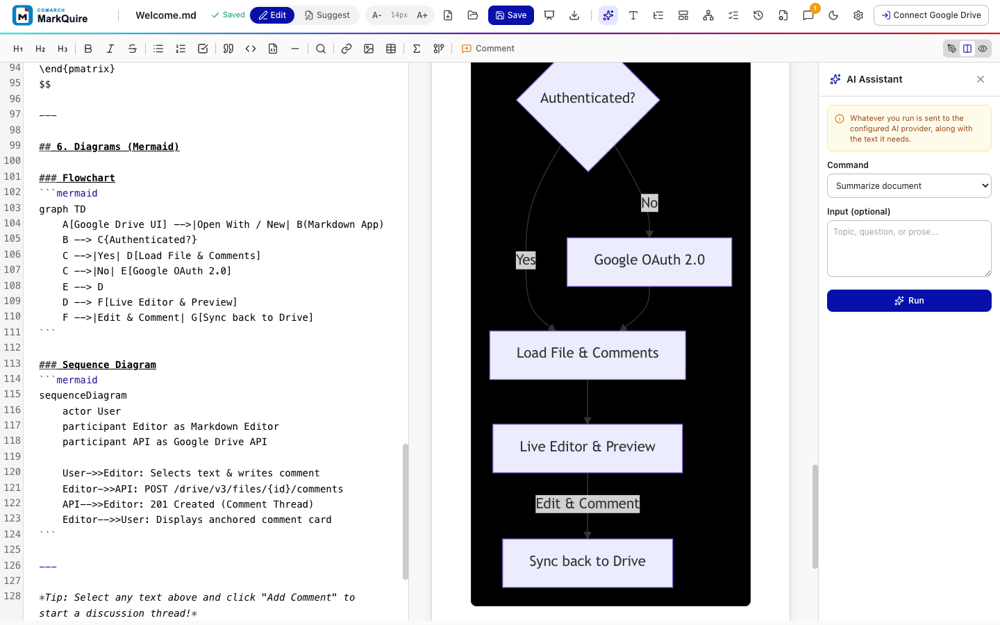
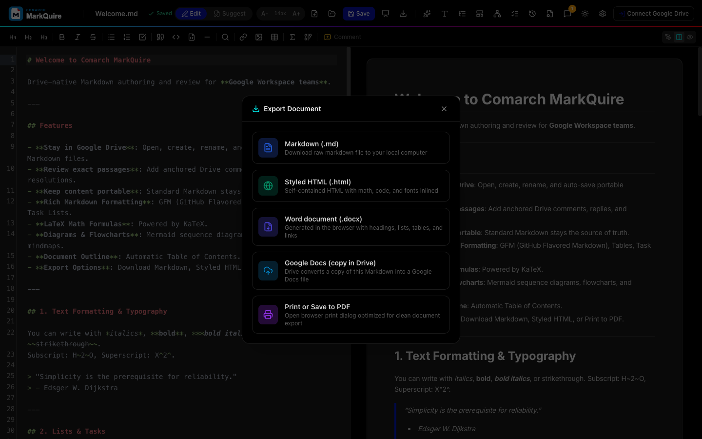
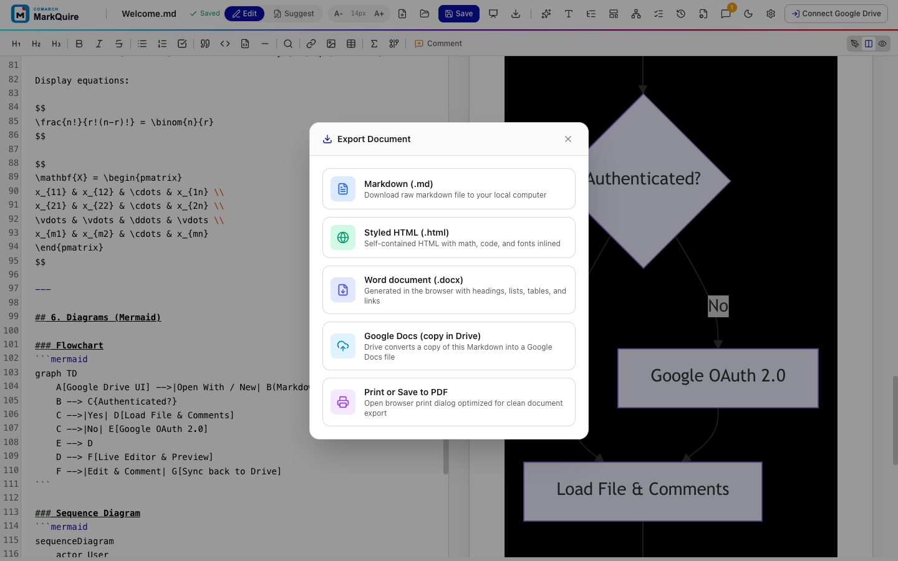
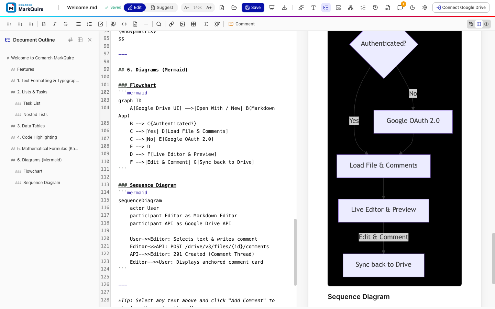
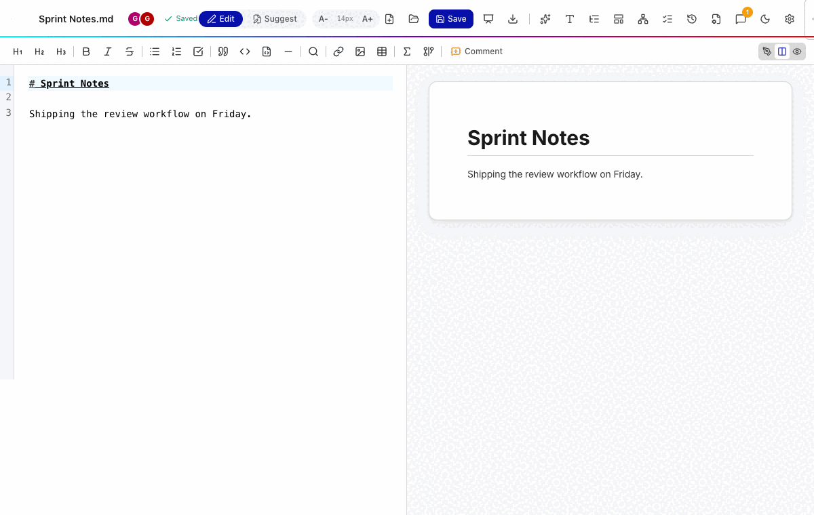
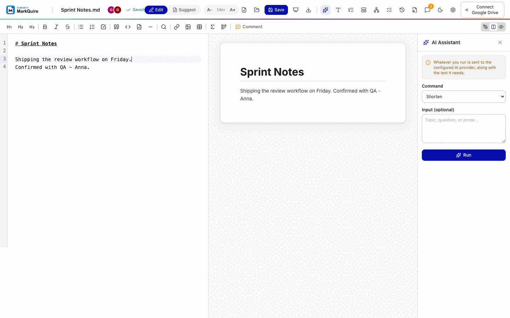

<p align="center">
  <picture>
    <source media="(prefers-color-scheme: dark)" srcset="./public/brand/comarch-markquire-dark.svg">
    
  </picture>
</p>

<p align="center">
  <strong>Markdown authoring for teams that live in Google Drive.</strong><br>
  Keep portable <code>.md</code> files, rich technical content, and review
  conversations in one familiar workflow.
</p>

<p align="center">
  <a href="https://github.com/comarch/MarkQuire/actions/workflows/ci.yml"></a>
  <a href="https://github.com/comarch/MarkQuire/actions/workflows/security.yml"></a>
  <a href="https://codecov.io/gh/comarch/MarkQuire"></a>
  <a href="./.nvmrc"></a>
  <a href="./promptscript.yaml"></a>
  <a href="./LICENSE"></a>
</p>



## Markdown for writers. Google Drive for reviewers.

Technical teams want Markdown because it is portable, versionable, and works
everywhere. Business teams want Google Drive because files, access, and review
already happen there.

MarkQuire connects both worlds:

1. Open an existing `.md` file with **Open with -> Comarch MarkQuire**, or
   create one from **New -> More**.
2. Write in a fast CodeMirror editor and see the rendered result beside it.
3. Discuss an exact passage with anchored Google Drive comment threads.
4. Save back to Drive or export to Markdown, HTML, Word, or Google Docs.

No proprietary document format. Markdown remains the source of truth.

## Why organizations choose MarkQuire

| Need                              | What MarkQuire provides                                                     |
| --------------------------------- | --------------------------------------------------------------------------- |
| One document home                 | Files stay in the team's existing Google Drive structure                    |
| Review without Markdown expertise | Reviewers comment on exact passages in a visual preview                     |
| Rich technical communication      | GFM, code highlighting, KaTeX formulas, and Mermaid diagrams                |
| Real-time teamwork                | Optional self-hosted companion adds co-editing and presence                 |
| Works when the network does not   | Draft cache and an offline save queue recover when connectivity returns     |
| Data residency control            | Browser-only core, no vendor backend, companion runs in your infrastructure |
| Safer Drive access                | OAuth uses the per-file `drive.file` scope                                  |
| Deployment control                | Open source, static web deployment, and private Workspace distribution      |

## See it in action

| Review in context                                                             | AI assistant (opt-in)                                                                  |
| ----------------------------------------------------------------------------- | -------------------------------------------------------------------------------------- |
|  |  |
| Comments retain quoted text, replies, and resolution state.                   | Summarize, rewrite, translate, or draft with a session-only API key.                   |

| Dark mode                                                                   | Export options                                                         |
| --------------------------------------------------------------------------- | ---------------------------------------------------------------------- |
|      |  |
| Pure black canvas with the brand cyan accent, easy on long review sessions. | Markdown, self-contained HTML, Word, Google Docs, and print-ready PDF. |

| WYSIWYG overlay                                                                   | Document outline                                                                |
| --------------------------------------------------------------------------------- | ------------------------------------------------------------------------------- |
|  |  |
| Hide Markdown marks and read the document as it will print.                       | Jump between sections and keep long documents navigable.                        |

### Real-time co-editing

Two authors work on one document through the optional self-hosted companion.
Edits and presence flow between sessions without a reload.



### The AI assistant applies changes to the file

The assistant runs a command, shows the result, and writes it into the
document only when the author accepts it.



## Product capabilities

All 32 roadmap items are implemented. The summary below groups them the way
teams use them.

### Drive-native file lifecycle

- Open `.md` and `.markdown` files from the Google Drive context menu.
- Create documents in the selected Drive folder and rename from the header.
- Auto-save after edits, save manually with `Ctrl+S`, and detect conflicting
  writes with Drive revision preconditions.
- Switch between recent Drive files without leaving the editor.
- Browse Drive version history and restore any revision.
- Follow cross-document links and return to the Drive file through its web link.

### Review workflow

- Select text and start a comment with `Ctrl+Alt+M` or `Cmd+Alt+M`.
- Keep quoted text and line context with the discussion.
- Reply, resolve, reopen, filter, and delete threads.
- Suggest mode records edits as reviewable suggestion comments.
- Review queue lists documents by frontmatter review status.
- Revision diff shows what changed between two Drive revisions.

### Rich Markdown

- GitHub Flavored Markdown tables, task lists, strikethrough, and autolinks.
- Syntax highlighting for more than 100 languages.
- Inline and display mathematics rendered with KaTeX.
- Mermaid flowcharts, sequence diagrams, mind maps, and Graphviz.
- Wikilinks with backlinks and a folder link graph.
- YAML frontmatter, footnotes, emoji, and an automatic document outline.

### Focused authoring

- Split, editor-only, and preview-only layouts with synchronized scrolling.
- WYSIWYG rich text view over the source editor.
- Formatting toolbar, table editing, and structure tools that move sections,
  number headings, and insert a table of contents.
- Templates and snippets, including organization templates from a Drive folder.
- Search and replace, quality checks, and interactive task checkboxes.
- Presentation mode turns headings into slides.
- Light and dark themes, English and Polish interface, mobile layout, and
  keyboard-accessible controls.

### Export and offline resilience

- Raw Markdown, self-contained HTML with assets inlined, and print-ready PDF.
- Word documents generated entirely in the browser.
- A Google Docs copy created through Drive.
- Offline save queue retries Drive writes when connectivity returns.

### AI assistant (feature-flagged)

- Opt-in Gemini integration with ten document commands, from summarizing to
  drafting, translating, and generating Mermaid diagrams from descriptions.
- The API key is kept for the session only and never written to storage.
- Build without the flag and the assistant does not ship at all.

### Companion service (optional, self-hosted)

- Real-time co-editing with presence indicators over a CRDT relay.
- Change notifications, an organization search index, and integrations.
- Compliance features with an audit log and configurable retention.
- Runs as a hardened Node.js container next to the SPA in your infrastructure.

## Position in the market

MarkQuire does not try to replace every Markdown tool. It is focused on a
specific gap: Markdown-first work inside a Google Drive-centered organization.

| Alternative                                                | Typical strength                                    | MarkQuire focus                                                  | Pricing                                         |
| ---------------------------------------------------------- | --------------------------------------------------- | ---------------------------------------------------------------- | ----------------------------------------------- |
| [StackEdit](https://stackedit.io/)                         | Browser editing and synchronization across services | Opinionated Drive file lifecycle plus Drive-backed review        | Free, open source                               |
| [HackMD](https://hackmd.io/)                               | Hosted real-time collaborative writing              | Drive-owned source files and organization-controlled deployment  | Free tier; paid team and enterprise plans       |
| [Typora](https://typora.io/)                               | Polished local desktop writing                      | Browser access, Drive entry points, and team review threads      | Paid one-time license                           |
| [Obsidian](https://obsidian.md/)                           | Linked local knowledge bases and personal workflows | Review of individual Drive files with non-technical stakeholders | Free for personal use; paid commercial and sync |
| [Google Docs](https://workspace.google.com/products/docs/) | Familiar rich-text collaboration                    | Portable Markdown source with technical rendering                | Free with a Google account; Workspace per user  |

MarkQuire itself is free and open source under MIT. Teams pay only for the
Google Workspace licenses they already hold, and the optional companion runs
inside their own infrastructure.

Choose MarkQuire when Google Drive is already the system of record and Markdown
must remain the final file format.

Comparison and pricing reflect public product information checked in September 2026. Products and plans can change.

## Try it locally

No Google Cloud credentials are needed for the demo mode.

```bash
git clone https://github.com/comarch/MarkQuire.git
cd MarkQuire
npm ci
npm run dev
```

Open [http://localhost:3000](http://localhost:3000). The local mode stores the
draft and simulated comments in browser storage.

Enable the AI assistant in local development with `VITE_ENABLE_AI=1 npm run dev`
and turn it on in settings.

## Connect Google Drive

Production Drive integration needs a Google Cloud OAuth client and Drive UI
configuration.

1. Copy the environment template.
2. Set `VITE_GOOGLE_CLIENT_ID`.
3. Configure the Drive **Open URL** and **New URL**.
4. Publish privately in your Google Workspace domain, subject to your admin
   policy.

```bash
cp .env.example .env
npm run dev
```

Follow the complete
[Google Workspace setup guide](./GOOGLE_WORKSPACE_SETUP.md).

## Deploy

Build the static application:

```bash
npm ci
npm run build
```

The reference deployment is GitHub Pages at
[https://comarch.github.io/MarkQuire/](https://comarch.github.io/MarkQuire/).
The `Pages` workflow publishes it after Pages is enabled for the repository and
the repository variable `ENABLE_GITHUB_PAGES` is set to `true`. A deployment
served from a subpath needs a matching build:

```bash
MARKQUIRE_BASE_PATH=/MarkQuire/ npm run build
```

Or run the included Nginx container:

```bash
docker build -t markquire .
docker run -d -p 3000:80 --name markquire markquire
```

To add co-editing, notifications, and organization search, run the full stack
with the companion service:

```bash
docker compose up -d
```

The companion keeps its state in a local volume. Point `PUBLIC_URL` at your TLS
terminator before enabling Drive webhooks. Without the companion, every other
feature above still works.

## Trust model and current scope

- MarkQuire is a browser SPA. The core repository ships no application backend
  and keeps no user data.
- Google API calls go from the browser to Google using the signed-in user's
  token. Tokens stay in session storage and clear when the session ends.
- The `drive.file` scope limits file access to files opened or created through
  the app.
- AI keys are memory-only. The assistant is opt-in and can be compiled out.
- The companion is optional, self-hosted, and runs as an unprivileged container.
  Content relayed for co-editing stays inside your deployment.
- Local demo mode is for evaluation and development. It is not a production
  offline synchronization system.
- Self-hosters remain responsible for OAuth configuration, hosting security,
  privacy review, and Workspace administration.

## Documentation

| Guide                                                  | Purpose                                                          |
| ------------------------------------------------------ | ---------------------------------------------------------------- |
| [Product overview](./docs/PRODUCT_OVERVIEW.md)         | Audience, value proposition, use cases, and market position      |
| [Competitive analysis](./docs/COMPETITIVE_ANALYSIS.md) | Competitor rings, gap analysis, and market constraints           |
| [Roadmap](./docs/ROADMAP.md)                           | Prioritized features with per-item implementation plans          |
| [User guide](./docs/USER_GUIDE.md)                     | Daily writing, review, export, settings, and troubleshooting     |
| [Brand and listing kit](./docs/BRAND.md)               | Logo assets, colors, repository copy, and Marketplace copy       |
| [Google Workspace setup](./GOOGLE_WORKSPACE_SETUP.md)  | OAuth, Drive UI integration, deployment, and private publication |
| [Compatibility](./docs/COMPATIBILITY.md)               | Runtime, browser, Google API, and unsupported combinations       |
| [Release and rollback](./docs/RELEASE.md)              | Versioning, artifacts, publishing, and recovery                  |
| [Validation](./docs/VALIDATION.md)                     | Local quality contract, CI checks, and manual release checks     |
| [Security model](./docs/SECURITY_MODEL.md)             | Data flow, trust boundaries, threats, and incident response      |
| [Repository settings](./docs/REPOSITORY_SETTINGS.md)   | Branch rules, checks, labels, secrets, and bootstrap audit       |
| [Contributing](./CONTRIBUTING.md)                      | Development workflow and validation                              |
| [Security](./SECURITY.md)                              | Supported versions and private vulnerability reporting           |

## Development

Requires Node.js 22 and npm.

```bash
npm run format:check
npm run lint
npm run typecheck
npm run test:coverage
npm run test:e2e
npm run build
npm run verify:artifact
npm run validate
```

`npm run validate` executes the complete project quality contract. Playwright
end-to-end tests run separately through `npm run test:e2e`. The companion
service has its own suite under `companion/` and runs with
`npm run test:companion`.

## Project status

MarkQuire is pre-1.0. All 32 roadmap items are implemented: the Drive file
lifecycle, conflict detection, version history, review workflow with suggestion
mode, rich rendering, structure and quality tools, templates, exports, the
offline queue, the reach work (mobile, accessibility, English and Polish), the
WYSIWYG overlay, the feature-flagged AI assistant, and the companion service
with co-editing, notifications, search, integrations, and compliance features.
Regression suites cover the browser app, the companion, and interactive flows
including a two-author co-editing session.

Production deployment still requires organization-specific Google Cloud and
Workspace configuration.

Contributions are welcome. Read [CONTRIBUTING.md](./CONTRIBUTING.md) and the
[Code of Conduct](./CODE_OF_CONDUCT.md).

## Support

- Report reproducible defects with the
  [bug form](https://github.com/comarch/MarkQuire/issues/new?template=bug_report.yml).
- Ask implementation questions in a redacted issue.
- Report vulnerabilities only through
  [private vulnerability reporting](https://github.com/comarch/MarkQuire/security/advisories/new).

## License

Author: Wojciech Guziak (Comarch S.A.).

[MIT](./LICENSE)
