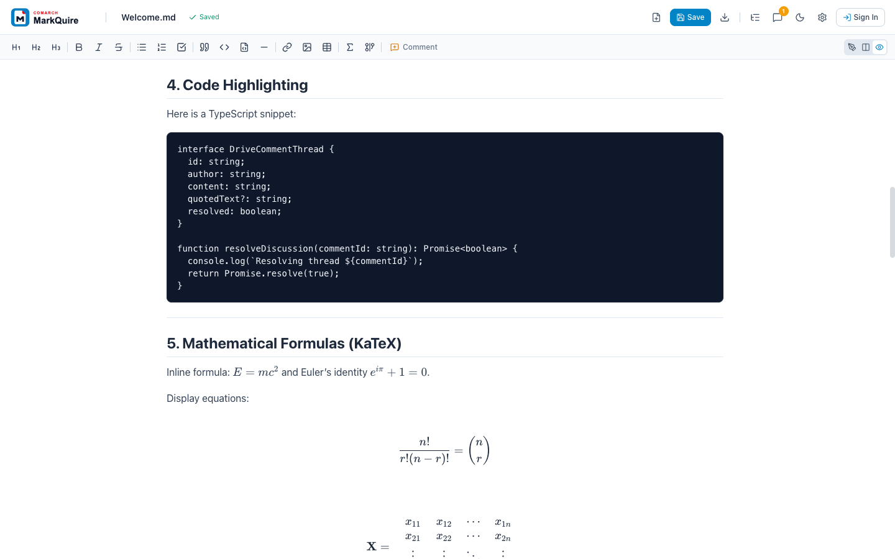

<p align="center">
  <picture>
    <source media="(prefers-color-scheme: dark)" srcset="./public/brand/comarch-markquire-dark.svg">
    
  </picture>
</p>

<p align="center">
  <strong>Markdown authoring for teams that live in Google Drive.</strong><br>
  Keep portable <code>.md</code> files, rich technical content, and review conversations in one familiar workflow.
</p>

<p align="center">
  <a href="https://github.com/comarch/MarkQuire/actions/workflows/ci.yml"></a>
  <a href="https://github.com/comarch/MarkQuire/actions/workflows/security.yml"></a>
  <a href="https://codecov.io/gh/comarch/MarkQuire"></a>
  <a href="./.nvmrc"></a>
  <a href="./promptscript.yaml"></a>
  <a href="./LICENSE"></a>
</p>


## Markdown for writers. Google Drive for reviewers.

Technical teams want Markdown because it is portable, versionable, and works everywhere. Business teams want Google Drive because files, access, and review already happen there.

MarkQuire connects both worlds:

1. Open an existing `.md` file with **Open with -> Comarch MarkQuire**, or create one from **New -> More**.
2. Write in a fast CodeMirror editor and see the rendered result beside it.
3. Discuss an exact passage with anchored Google Drive comment threads.
4. Save back to Drive or export to Markdown, styled HTML, or PDF.

No proprietary document format. Markdown remains the source of truth.

## Why teams choose MarkQuire

| Need                              | What MarkQuire provides                                                |
| --------------------------------- | ---------------------------------------------------------------------- |
| One document home                 | Files stay in the team's existing Google Drive structure               |
| Review without Markdown expertise | Reviewers comment on exact passages in a visual preview                |
| Rich technical communication      | GFM, code highlighting, KaTeX formulas, and Mermaid diagrams           |
| Less context switching            | Create, rename, save, discuss, and export in one browser workspace     |
| Deployment control                | Open source, static web deployment, and private Workspace distribution |
| Safer Drive access                | OAuth uses the per-file `drive.file` scope                             |

## See it in action

| Review in context                                                             | Present technical content clearly                                           |
| ----------------------------------------------------------------------------- | --------------------------------------------------------------------------- |
|  |  |
| Comments retain quoted text, replies, and resolution state.                   | Preview code, formulas, tables, tasks, and diagrams without extra tooling.  |

## Product capabilities

### Drive-native file lifecycle

- Open `.md` and `.markdown` files from the Google Drive context menu.
- Create documents in the selected Drive folder.
- Rename the file from the editor header.
- Auto-save after edits and save manually with `Ctrl+S` or `Cmd+S`.
- Return to the Drive file through its web link.

### Review workflow

- Select text and start a comment with `Ctrl+Alt+M` or `Cmd+Alt+M`.
- Keep quoted text and line context with the discussion.
- Reply, resolve, reopen, filter, and delete threads.
- See active comment highlights in the rendered preview.

### Rich Markdown

- GitHub Flavored Markdown tables, task lists, strikethrough, and autolinks.
- Syntax highlighting for more than 100 languages.
- Inline and display mathematics rendered with KaTeX.
- Mermaid flowcharts, sequence diagrams, and mind maps.
- Emoji, links, images, blockquotes, and an automatic document outline.

### Focused writing experience

- Split, editor-only, and preview-only layouts.
- Synchronized editor and preview scrolling.
- Light and dark themes.
- Formatting toolbar and table generator.
- Export to raw Markdown, styled HTML, or print-ready PDF.

## Position in the market

MarkQuire does not try to replace every Markdown tool. It is focused on a specific gap: Markdown-first work inside a Google Drive-centered organization.

| Alternative                                                | Typical strength                                    | MarkQuire focus                                                  |
| ---------------------------------------------------------- | --------------------------------------------------- | ---------------------------------------------------------------- |
| [StackEdit](https://stackedit.io/)                         | Browser editing and synchronization across services | Opinionated Drive file lifecycle plus Drive-backed review        |
| [HackMD](https://hackmd.io/)                               | Hosted real-time collaborative writing              | Drive-owned source files and organization-controlled deployment  |
| [Typora](https://typora.io/)                               | Polished local desktop writing                      | Browser access, Drive entry points, and team review threads      |
| [Obsidian](https://obsidian.md/)                           | Linked local knowledge bases and personal workflows | Review of individual Drive files with non-technical stakeholders |
| [Google Docs](https://workspace.google.com/products/docs/) | Familiar rich-text collaboration                    | Portable Markdown source with technical rendering                |

Choose MarkQuire when Google Drive is already the system of record and Markdown must remain the final file format.

Comparison reflects public product information checked in September 2026. Products and plans can change.

## Try it locally

No Google Cloud credentials are needed for the demo mode.

```bash
git clone https://github.com/comarch/MarkQuire.git
cd MarkQuire
npm ci
npm run dev
```

Open [http://localhost:3000](http://localhost:3000). The local mode stores the draft and simulated comments in browser storage.

## Connect Google Drive

Production Drive integration needs a Google Cloud OAuth client and Drive UI configuration.

1. Copy the environment template.
2. Set `VITE_GOOGLE_CLIENT_ID`.
3. Configure the Drive **Open URL** and **New URL**.
4. Publish privately in your Google Workspace domain, subject to your admin policy.

```bash
cp .env.example .env
npm run dev
```

Follow the complete [Google Workspace setup guide](./GOOGLE_WORKSPACE_SETUP.md).

## Deploy

Build the static application:

```bash
npm ci
npm run build
```

The reference deployment is GitHub Pages at
[https://comarch.github.io/MarkQuire/](https://comarch.github.io/MarkQuire/).
The `Pages` workflow publishes it after Pages is enabled for the repository and
the repository variable `ENABLE_GITHUB_PAGES` is set to `true`. A deployment
served from a subpath needs a matching build:

```bash
MARKQUIRE_BASE_PATH=/MarkQuire/ npm run build
```

Or run the included Nginx container:

```bash
podman build --format docker -t markquire .
podman run -d -p 3000:80 --name markquire markquire
```

## Trust model and current scope

- MarkQuire is a browser SPA. This repository does not include an application backend.
- Google API calls go from the browser to Google using the signed-in user's token.
- Access tokens stay in session storage and are cleared when the browser session ends or the user signs out.
- The `drive.file` scope limits file access to files opened or created through the app.
- Local demo mode is for evaluation and development. It is not a production offline synchronization system.
- Threaded comments are synchronized through the Drive Comments API. Simultaneous text co-editing is not currently supported.
- Self-hosters remain responsible for OAuth configuration, hosting security, privacy review, and Workspace administration.

## Documentation

| Guide                                                  | Purpose                                                          |
| ------------------------------------------------------ | ---------------------------------------------------------------- |
| [Product overview](./docs/PRODUCT_OVERVIEW.md)         | Audience, value proposition, use cases, and market position      |
| [Competitive analysis](./docs/COMPETITIVE_ANALYSIS.md) | Competitor rings, gap analysis, and market constraints           |
| [Roadmap](./docs/ROADMAP.md)                           | Prioritized features with per-item implementation plans          |
| [User guide](./docs/USER_GUIDE.md)                     | Daily writing, review, export, settings, and troubleshooting     |
| [Brand and listing kit](./docs/BRAND.md)               | Logo assets, colors, repository copy, and Marketplace copy       |
| [Google Workspace setup](./GOOGLE_WORKSPACE_SETUP.md)  | OAuth, Drive UI integration, deployment, and private publication |
| [Compatibility](./docs/COMPATIBILITY.md)               | Runtime, browser, Google API, and unsupported combinations       |
| [Release and rollback](./docs/RELEASE.md)              | Versioning, artifacts, publishing, and recovery                  |
| [Validation](./docs/VALIDATION.md)                     | Local quality contract, CI checks, and manual release checks     |
| [Security model](./docs/SECURITY_MODEL.md)             | Data flow, trust boundaries, threats, and incident response      |
| [Repository settings](./docs/REPOSITORY_SETTINGS.md)   | Branch rules, checks, labels, secrets, and bootstrap audit       |
| [Contributing](./CONTRIBUTING.md)                      | Development workflow and validation                              |
| [Security](./SECURITY.md)                              | Supported versions and private vulnerability reporting           |

## Development

Requires Node.js 22 and npm.

```bash
npm run format:check
npm run lint
npm run typecheck
npm run test:coverage
npm run test:e2e
npm run build
npm run verify:artifact
npm run validate
```

`npm run validate` executes the complete project quality contract. Playwright
end-to-end tests run separately through `npm run test:e2e`.

## Project status

MarkQuire is pre-1.0. The core authoring, preview, Drive file, comment, and
export workflows are implemented, together with save conflict detection, Drive
version history, image paste and upload, search and replace, and interactive
task checkboxes. Playwright end-to-end tests cover the demo-mode workflows.
Production deployment still requires organization-specific Google Cloud and
Workspace configuration.

Contributions are welcome. Read [CONTRIBUTING.md](./CONTRIBUTING.md) and the [Code of Conduct](./CODE_OF_CONDUCT.md).

## Support

- Report reproducible defects with the
  [bug form](https://github.com/comarch/MarkQuire/issues/new?template=bug_report.yml).
- Ask implementation questions in a redacted issue.
- Report vulnerabilities only through
  [private vulnerability reporting](https://github.com/comarch/MarkQuire/security/advisories/new).

## License

[MIT](./LICENSE)
