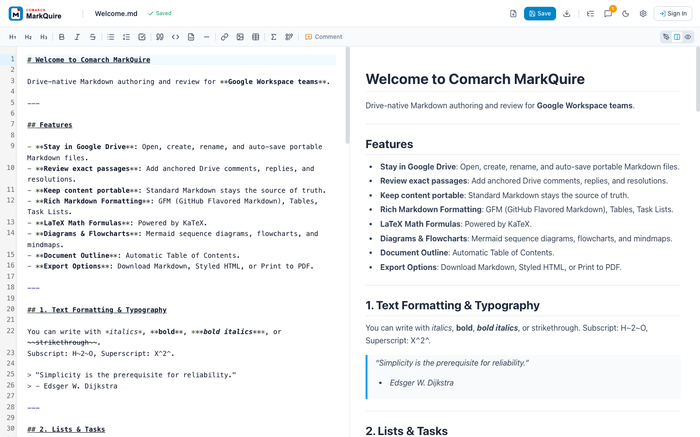

# Product overview

## The short version

**Comarch MarkQuire is Markdown authoring for teams that live in Google Drive.**

It keeps the portability and precision of Markdown while adding the Drive entry points, visual preview, and passage-level review workflow needed by a wider organization.

## The problem

Markdown works well for technical content. It remains readable as plain text, moves between tools, and represents code, tables, tasks, formulas, and diagrams.

Review often happens elsewhere. Stakeholders may ask for a converted document, a pasted Google Doc, or a screenshot because raw Markdown is not their daily tool. This creates duplicate files, broken feedback loops, and uncertainty about which copy is final.

MarkQuire removes that handoff:

- authors keep writing Markdown;
- reviewers get a rendered document and familiar comment threads;
- files stay in the organization's Google Drive;
- the `.md` file remains the source of truth.

## Who it is for

| Audience                 | Typical job                                                | Product value                                            |
| ------------------------ | ---------------------------------------------------------- | -------------------------------------------------------- |
| Engineering teams        | Write runbooks, RFCs, release notes, and architecture docs | Rich technical rendering without leaving Drive           |
| Product teams            | Review specifications and decisions with engineers         | Comment on exact passages without learning Markdown      |
| Technical writers        | Maintain portable documentation with structured review     | One source file, visual preview, and export options      |
| Operations and support   | Keep procedures close to shared Drive workflows            | Familiar access, folder structure, and review process    |
| Workspace administrators | Offer an internal Markdown capability                      | Private distribution and organization-controlled hosting |

## Product promise

### Stay in the system of record

Users can create or open Markdown documents from Google Drive. File names, content, and comments use the Drive file lifecycle instead of a separate workspace.

### Make technical content easy to review

The preview renders tables, task lists, highlighted code, KaTeX formulas, Mermaid diagrams, and standard Markdown. Reviewers see the intended document, not formatting syntax.

### Keep feedback attached to meaning

Comments retain quoted text and line context. Threads support replies, resolution, reopening, filtering, and navigation between feedback and content.

### Avoid format lock-in

MarkQuire stores standard Markdown. Users can download the source, create styled HTML, or print to PDF.

### Fit organization deployment needs

The app is open source and deploys as static browser assets behind Nginx or another web server. Google Workspace administrators control OAuth setup, hosting, and private Marketplace distribution.

## Core workflow

1. **Enter from Drive:** Create a new Markdown document in the selected folder
   or open an existing `.md` file.
2. **Author with feedback:** Write in CodeMirror while the rendered result
   updates beside the source.
3. **Review exact content:** Select a passage, start a thread, reply, and
   resolve the discussion.
4. **Save to the same file:** Auto-save or use `Ctrl+S` / `Cmd+S`. Rename the
   file from the header.
5. **Share the right output:** Keep the Markdown source or export HTML/PDF for
   another audience.

## What makes MarkQuire different

MarkQuire combines four capabilities in one focused workflow:

1. **Native Drive entry points** through **New** and **Open with**.
2. **Markdown-first storage** rather than a proprietary document model.
3. **Rich technical rendering** for code, math, and diagrams.
4. **Anchored Drive review threads** around exact document passages.

Many products cover one or two of these jobs well. MarkQuire is designed around their intersection.

## Market position

| Product category                                                                    | Good fit when                                                 | MarkQuire is a better fit when                                       |
| ----------------------------------------------------------------------------------- | ------------------------------------------------------------- | -------------------------------------------------------------------- |
| Browser Markdown editors such as [StackEdit](https://stackedit.io/)                 | Users need a broad browser editor and service synchronization | Drive is the primary file home and review workflow                   |
| Hosted collaboration such as [HackMD](https://hackmd.io/)                           | Simultaneous collaborative writing is the main requirement    | Organization-controlled deployment and Drive-owned files matter more |
| Desktop editors such as [Typora](https://typora.io/)                                | One author wants a polished local writing environment         | Reviewers need browser access and Drive comment threads              |
| Knowledge bases such as [Obsidian](https://obsidian.md/)                            | Linked notes and personal or team vaults are the main model   | Work centers on individual Drive documents and stakeholder review    |
| Rich-text suites such as [Google Docs](https://workspace.google.com/products/docs/) | Rich-text collaboration is more important than source format  | Portable Markdown must remain the final artifact                     |

This comparison reflects public product information checked in September 2026. It describes different product focus, not feature parity across every plan.

## Trust model

- MarkQuire is a browser SPA. It has no repository-provided application backend.
- OAuth uses the per-file `drive.file` scope.
- Access tokens are stored in session storage, not source code or local storage.
- Drive API calls use the signed-in user's token.
- Local demo mode uses browser storage and simulated comments.
- Self-hosters own hosting security, OAuth configuration, privacy review, and Workspace policy.

See the [Security Policy](../SECURITY.md) and [Workspace setup guide](../GOOGLE_WORKSPACE_SETUP.md).

## Current boundaries

MarkQuire is pre-1.0.

- Simultaneous text co-editing is not implemented.
- Production use requires a configured Google Cloud project and OAuth client.
- Offline mode is a local evaluation fallback, not Drive synchronization.
- Comments depend on Drive file capabilities and the signed-in user's permissions.
- Public Marketplace publication may require additional Google review and organization approval.

These boundaries are explicit so teams can evaluate the product against the right use case.

## Suggested success measures

Teams evaluating MarkQuire can track:

- time from opening a Drive file to the first accepted edit;
- percentage of reviews completed without converting to another format;
- number of duplicate Markdown and rich-text copies created per document;
- comment resolution time;
- weekly active authors and reviewers;
- save and Drive API error rate.
