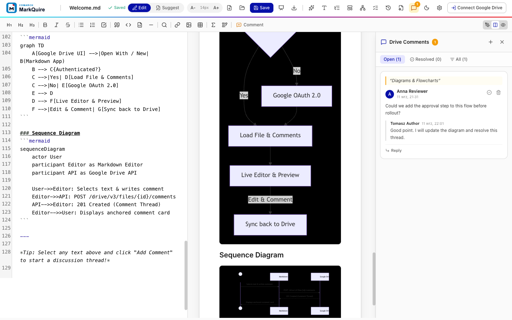

# User guide

## Start in demo mode

Demo mode shows the complete editor without Google credentials.

```bash
npm ci
npm run dev
```

Open [http://localhost:3000](http://localhost:3000).

The sample document demonstrates tables, task lists, code, formulas, and diagrams. Draft content and simulated comments are stored in the browser.

## Open or create a Drive document

After an administrator completes the [Google Workspace setup](../GOOGLE_WORKSPACE_SETUP.md):

- use **New -> More -> Comarch MarkQuire** to create a `.md` file in the current folder;
- right-click a `.md` or `.markdown` file and select **Open with -> Comarch MarkQuire**;
- use the new-document button in MarkQuire to create another file.

Google Drive passes file context to MarkQuire in the URL. The app then loads or creates the requested file.

## Connect your account

1. Select **Sign In** in the top-right corner.
2. Choose a Google Workspace account.
3. Review the requested access.
4. Continue to the document.

MarkQuire requests `drive.file` access. This allows the app to work with files opened or created through it. Profile and email scopes support the signed-in user display.

Select the user menu and **Disconnect Google Drive** to clear the session.

## Write and format

The default split view shows Markdown source on the left and rendered content on the right.

Use the toolbar for:

- headings;
- bold, italic, and strikethrough;
- bullet, numbered, and task lists;
- blockquotes, inline code, and code blocks;
- links and images;
- tables;
- KaTeX formulas;
- Mermaid diagrams;
- comments.

### Search and replace

Select the search button in the toolbar or press `Ctrl+F` / `Cmd+F`. The search
panel supports regular expressions, case sensitivity, single replace, and
replace all. Replace all applies as one edit, so a single `Ctrl+Z` undoes the
whole replacement.

### Interactive task lists

Task list checkboxes in the preview are clickable. Ticking a box rewrites the
Markdown source line, so the change is part of the portable file and survives
export.

### Paste images

Paste or drop an image into the editor while a Drive document is open. MarkQuire
uploads the image to the same Drive folder and inserts a Markdown image
reference at the cursor. Image upload needs a signed-in session and edit access
to the folder. In demo mode pasted images are not uploaded.

### View modes

| Mode         | Use it for                            |
| ------------ | ------------------------------------- |
| Editor only  | Maximum writing space                 |
| Split        | Source and rendered output together   |
| Preview only | Reading, presenting, and final review |

Use the theme button to switch between light and dark mode.

## Navigate a long document

Select the outline button in the header. MarkQuire extracts headings from the current document and builds a navigable outline.

Selecting a heading moves both the editor and preview to that section.

When synchronized scrolling is enabled, moving one pane keeps the other pane at the corresponding document position.

## Add a review comment

1. Select text in the editor.
2. Select **Comment** or press `Ctrl+Alt+M` / `Cmd+Alt+M`.
3. Enter the review note.
4. Submit the comment.

The thread keeps the quoted passage and available line context. Active comments appear as highlights in the rendered preview.

### Manage threads

Open the comments sidebar to:

- filter open, resolved, or all threads;
- read replies;
- add a reply;
- resolve a discussion;
- reopen a resolved discussion;
- delete a thread.



## Save and rename

MarkQuire auto-saves after the configured delay.

- press `Ctrl+S` / `Cmd+S` for an immediate save;
- watch the header for **Unsaved**, **Saving**, **Saved**, or **Save failed**;
- select the file name in the header to rename it.

When the document comes from Drive, content and title changes are written to the same Drive file. In demo mode they remain in local browser storage.

## Resolve save conflicts

Before every save, MarkQuire checks the current Drive revision of the open
file. When another session saved a new version in the meantime, the save stops
and a merge dialog opens:

- the dialog shows a three-way merge of your changes, the Drive version, and
  the version both sessions started from;
- conflicting passages are marked with LOCAL, BASE, and REMOTE blocks;
- edit the merged text, remove the markers, and save; or keep your version or
  the Drive version with one click.

The saved result becomes the newest Drive revision, so nothing is lost
silently.

## Export

Select the export button in the header.

| Format       | Result                                                         |
| ------------ | -------------------------------------------------------------- |
| Markdown     | Downloads the portable `.md` source                            |
| Styled HTML  | Downloads an HTML document with embedded layout styles         |
| Print or PDF | Opens the browser print workflow with document-focused styling |

Choose Markdown for future editing, HTML for easy sharing, and PDF for a fixed review or archive copy.

Styled HTML uses public CDN stylesheets for KaTeX and code highlighting when the exported file is opened.

## Settings

The settings dialog controls:

- Google OAuth client ID;
- auto-save delay;
- editor font size;
- synchronized scrolling;

The OAuth client ID is normally supplied by the deployment environment. Manual entry is useful for development or testing.

## Keyboard shortcuts

| Action      | Windows/Linux | macOS       |
| ----------- | ------------- | ----------- |
| Save        | `Ctrl+S`      | `Cmd+S`     |
| Add comment | `Ctrl+Alt+M`  | `Cmd+Alt+M` |
| Bold        | `Ctrl+B`      | `Cmd+B`     |
| Italic      | `Ctrl+I`      | `Cmd+I`     |
| Search      | `Ctrl+F`      | `Cmd+F`     |
| Print / PDF | `Ctrl+P`      | `Cmd+P`     |

## Troubleshooting

### Sign in opens demo mode

No Google OAuth client ID is configured. Ask the deployment administrator to set `VITE_GOOGLE_CLIENT_ID`, or enter the approved client ID in settings.

### A Drive file does not open

Check that:

- the file was opened through the configured Drive integration;
- the Open URL points to the deployed MarkQuire address;
- the user can access the file;
- the OAuth client accepts the deployment origin;
- the Drive API is enabled.

### Comments do not load

The user needs comment capability on the file. Confirm Drive permissions and inspect the browser console for a Drive API error.

### Save failed

Confirm network access, file edit permission, OAuth session validity, and the configured JavaScript origin. Retry with the Save button after restoring access.

### Content from an earlier demo appears

Demo drafts use browser storage. Clear site data for the local MarkQuire origin to reset the demo.
